# Smart India Hackathon

## About the Problem
| Section                           | Content                           |
| ---                               | ---                               |
| Problem statement ID              | 1656                              |
| Problem Statement Title           | Development of a mobile application to provide recreational suitability information of beach locations across India   |
| Description                       | [link][weblink-sih-problemstatement]  |
| Organization                      | Ministry of Earth Sciences        |
| Department                        | Indian National Center for Ocean Information Services (INCOIS)    |
| Category                          | Software                          |
| Theme                             | Travel & Tourism                  |

## Team Requirement as stated by the organization of the hackethon
- Min and Max 6 members
- Atleast one female member
- At least 1 mentor, but a max limit of 2 mentor is imposedV
    <!-- Source: https://www.sih.gov.in/faqs -->
    - A Mentor is "*any senior faculty and domain expert that will guide the team and nurture their idea*"

## Requirements as stated from the problem description
- Solution goals:
    - As of the moment, the solution to the following problem is restricted locally to India
    - Improving tourism and related sectors
    - Soak up the increase in the costal tourism market
    - Safety of the tourist
- Mobile Application:
    - Indicating the suitability of beaches for:
        - Recreational activities
            - Based on ocean states like wave heights/ocean currents, meteorologivcal paremeters like win, water quality
            - High Wave/Swell Surge/Ocean Currents/Storm Surge/Tsunami
            - Winds, Water quality assessments
    - Display the suitable/viability of the tourist's trip to the beaches in India
    - Users can search coastal location for recreation activities
    - Create locations of different beaches across the country
    - "*The application should devise a method/algorithm to use the above parameters and make the safety/suitability decision at the different locations*"
    - "*Visualization using geospatial maps and colour codes based on suitability of locations*"
    - "*Based on the current location of the user, alert notifications to be provided in case of any alerts in the coastal location of the user to be provided*"

## Expected Solution as stated from the problem description:
"*Design and development of a mobile application which identifies suitability of coastal tourism sites based on the current weather and oceanic conditions. This can help to save lives and better plan the coastal tourist/recreational activities for the user*"

## Application
### Features
- Threat Level indication
- Emergency contact number
- Weather forecasting news outlets
- Date-and-Time selection
- Live Weather
- GPS-location ability
- Weather forecasting and prediction
- Weather properties
    - Precipitation
    - Hail Probabilty
- Information Tab
- Accounting for variation of screen sizes and android version

## Project Phase

```mermaid
graph TB
    TeamFormation[Team Formation🟢]
    PrototypeProduct[Proto-type Product🟠]
    FinalProduct[Final Product🔴]

    TeamFormation --> PrototypeProduct --> FinalProduct
```

## Resources
- Weather parameters are available via Indian National Centre for Ocean Information Services (INCOIS) API
- "*The oceanic alerts information will be available via REST API. Water quality assessment is available from https://incois.gov.in/portal/wqns/water_quality.jsp*"
- Data from openweathermap
    - About the [api][weblink-openweathermap-api]

## Links
[Problem statement][weblink-sih-problemstatement]

<!-- weblink -->
[weblink-sih-problemstatement]: https://www.sih.gov.in/sih2024PS?technology_bucket=QWxs&category=QWxs&organization=TWluaXN0cnkgb2YgRWFydGggU2NpZW5jZXM=&organization_type=QWxs
[weblink-openweathermap-api]: https://openweathermap.org/api/one-call-3